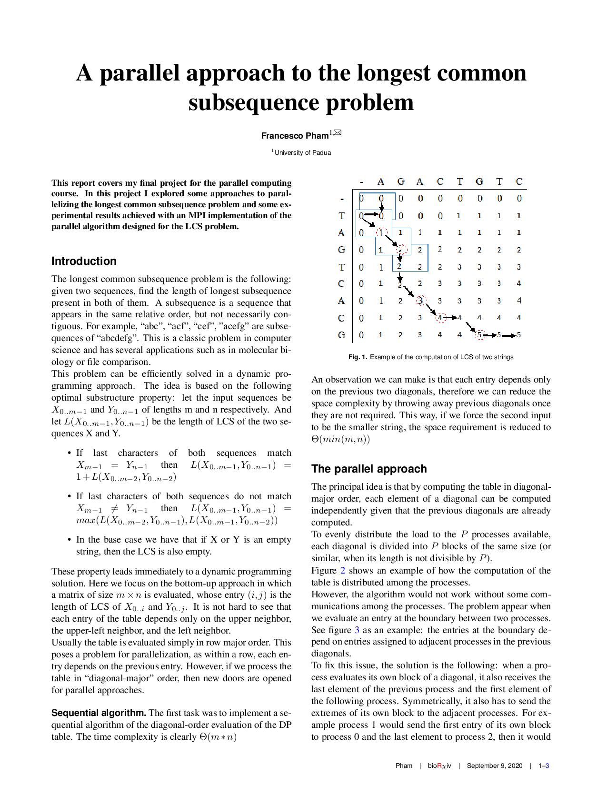
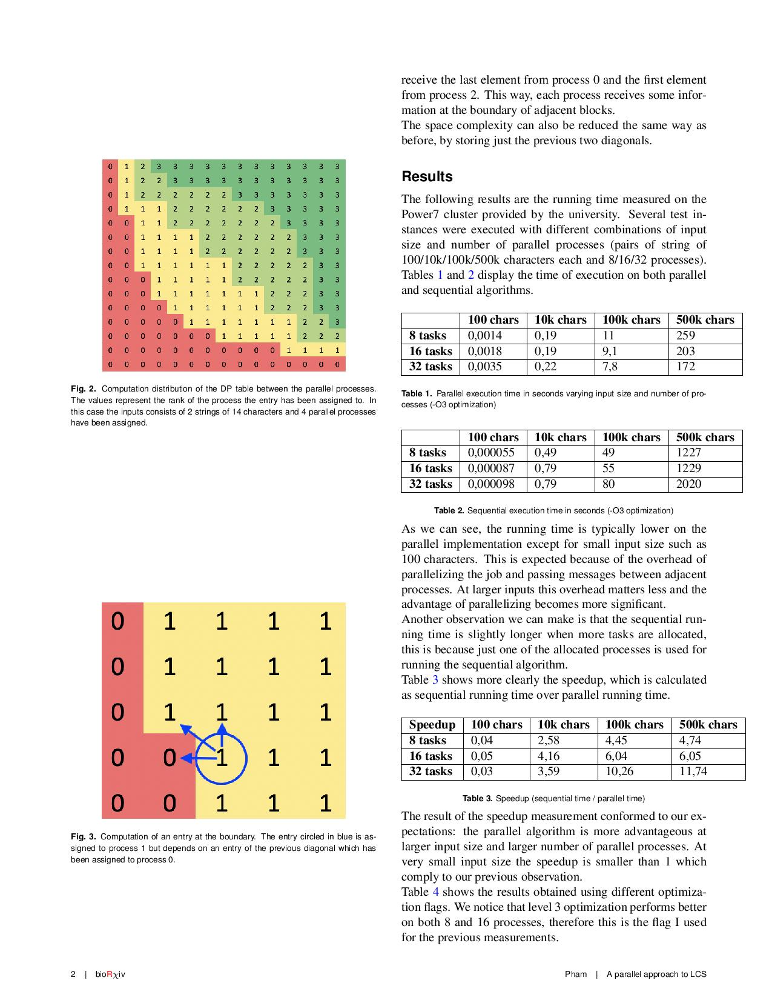
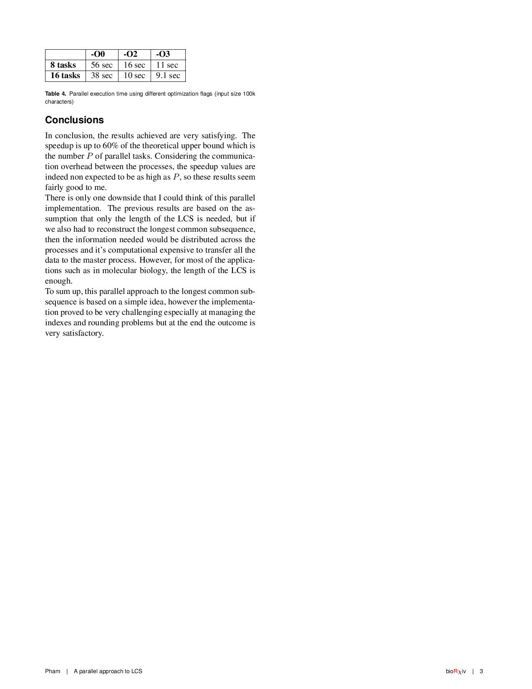

# lcs-parallel
This is a parallel implementation of the longest common subsequence algorithm in MPI.\
In this repository you can find the following content:
- some randomly generated inputs of different size.
- `generate_input.py` is the python script used to generate the inputs.
- `main.c` contains the implementation of the parallel and also the sequential LCS algorithm.
- `Makefile`: run `make` to compile the code with mpCC
- A `lcs_parallel.job` file to run the program on a load leveler.

## Report

## Author
Francesco Pham